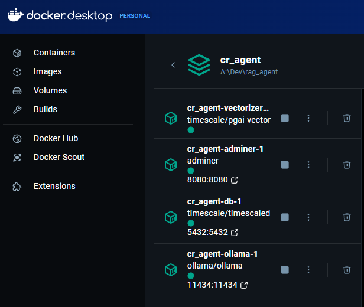
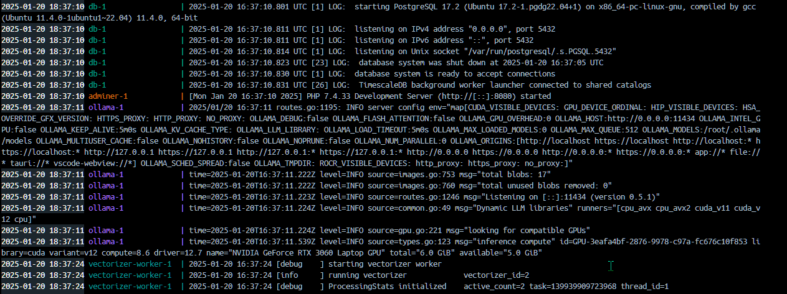
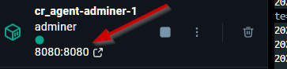
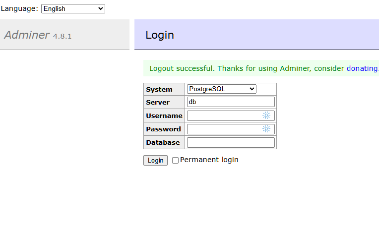
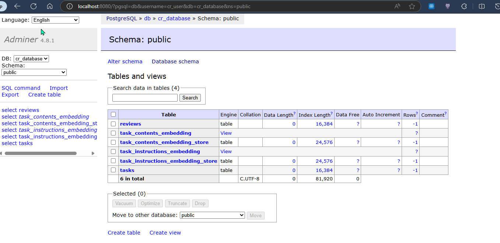
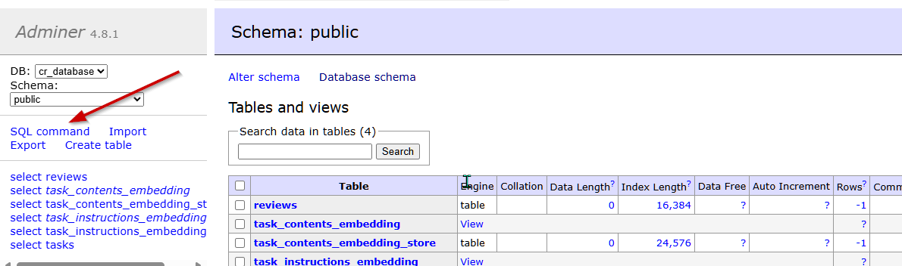

## Code review agent usage

### BUILD

1. Open terminal.
2. Run `cd <dir>` (`dir` you want to clone into).
3. Clone the repository:
    ```bash
      git clone https://github.com/brandenvs/code_review_agent.git
    ```
4. **Build, monitor and stop** application services using docker:
    ```bash
      docker compose up --build -d
      docker compose logs -f
      docker compose down
    ```

### ACCESS 

Access Database via Adminer (GUI approach).

1. Make sure all containers are up and running, if you have docker desktop you can click the `cr_container` and the containers statuses and logs files.
   

   *start up combined logs*:
   

2. You can also check on Linux by running `sudo docker ps` and confirming 4 containers are running.
3. Open your browser and go to [localhost:8080](http://localhost:8080/?pgsql=db) / Click on the `8080:8080` port on desktop.


You will be prompted with a login.


#### PostgreSQL credentials:

- **POSTGRES_USER**: `cr_user`
- **POSTGRES_DB**: `cr_database`
- **POSTGRES_PASSWORD**: `crauto2025`

*Successful login*:


4. Click `SQL command`:
  

5. Run the following statement to install the pgAI extension:
   ```bash
   CREATE EXTENSION IF NOT EXISTS ai CASCADE;
   ```
*You should have the `vectorizer-worker-1` dependency warning resolved.*

1. Now use the `startup_final.ipynb` Juypter notebook and `cheatsheet.ipynb` to build the pipeline and start inserting data based on the given our your own schemas.If you require more assistance than this I suggest taking a look at  [TimescaleDb](https://www.timescale.com/).

### 📝‼️ **NOTE**:

**I plan to build a Django application which will build alongside the other services in `docker-compose.yml`. This will allow me to build a secure ecosystem with a frontend (Django) web application.** 
